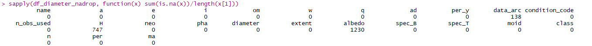
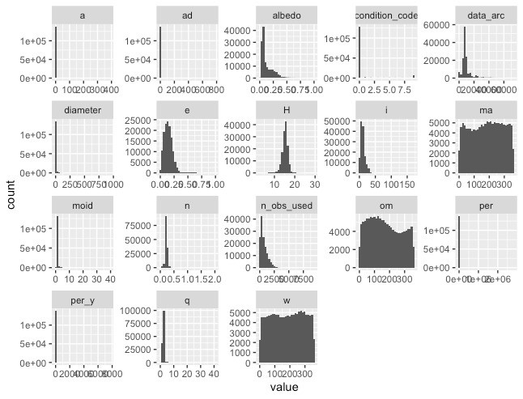
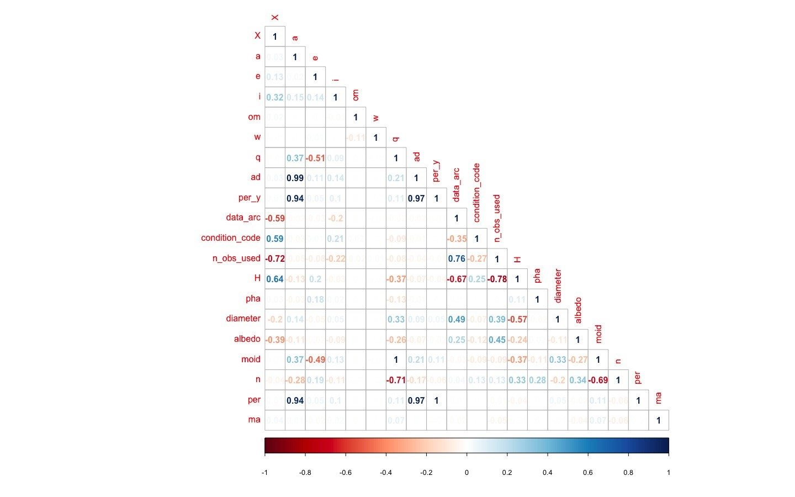
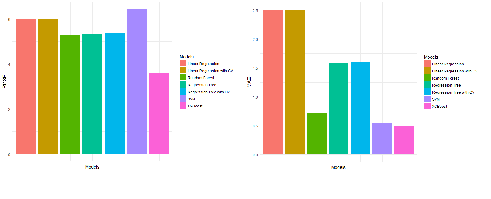
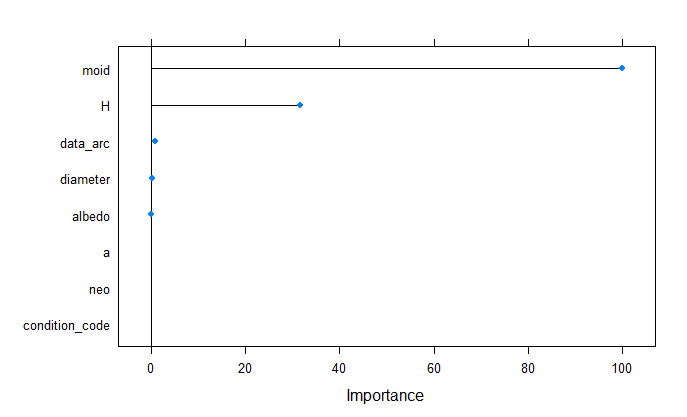
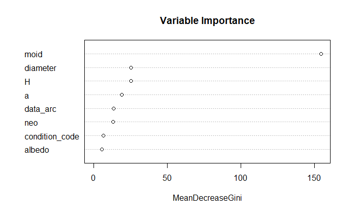
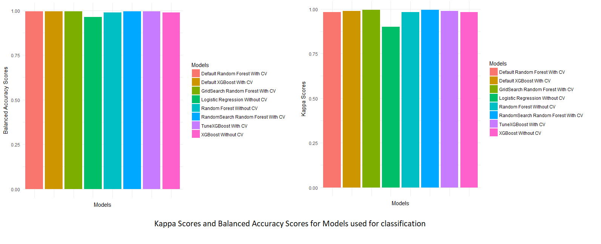

```{r setup, include=FALSE}
knitr::opts_chunk$set(echo = TRUE)
```

**Background**  **and**  **Motivation:**

The Asteroid data is officially maintained by Jet Propulsion Laboratory of California Institute of Technology, USA which is an organization under NASA. Asteroids are small rocky bodies primarily in orbit between Jupiter and Mars (i.e. main-belt). The diameter of the observed asteroids ranges from 948 km (1 Ceres) to a few meters. Near-Earth asteroids (NEAs) are a subset of asteroids whose orbits approach and/or cross the Earth's orbit. These asteroids have been known to collide with Earth in the past and have been the cause of modifying Earth’s biosphere greatly. It is particularly beneficial in predicting the size of the asteroid, because that would allow us to find those that are likely to collide with Earth. Our analysis might help in: 

1) Early Warning system that monitors impacts. 

2) Studying composition of such objects might lead in exploiting raw-materials beneficial to our planet. 

xx - add on classification - xx
**Related**  **work:**


**Research** **questions:**

What questions are you trying to answer?

How did these questions evolve over the course of the project?

What new questions did you consider in the course of your analysis?

**Data:**

The overall recorded data set consists of the asteroid data of 839,736 asteroid types. This dataset is officially maintained by [Jet Propulsion Laboratory](https://ssd.jpl.nasa.gov/sbdb_query.cgi) of California Institute of Technology, USA which is an organization under NASA. The dataset can be downloaded from [Kaggle](https://www.kaggle.com/basu369victor/prediction-of-asteroid-diameter). The Datasets are in the form of .csv files, with few new entries and additional new columns in the updated asteroid csv sheet. The dimension of the dataset is 839,736 (observations) * 31 (attributes). The 31 columns are the basic and physical properties of asteroids.The only parameter determined for nearly all asteroids is the absolute magnitude (H) which can be used to obtain a very rough estimate of an asteroid's size. However, a few asteroids have other parameters determined including rotation period, geometric albedo, colors (B-V, U-B, I-R), spectral taxonomic type, mass (GM), and bulk density etc. 

Preprocessing

The first step in the preprocessing is to fix the target variable column - diameter. “diameter”  in the original dataset is a column of type character. A simple type transformation was used to change it to type numeric. 


```{r eval=FALSE}
#convert diameter to numeric
df$diameter <- as.numeric(as.character(df$diameter))
```

The next step was to treat the null values in the target variable column. Out of 800000 entries, there were 650000 null values which were removed. Filling them with either the mean or the median was considered but since that would lead to an inaccurate distribution, these options were not taken and the null entries were removed. 


```{r eval=FALSE}
#drop na's in diameter column
df_diameter_nadrop <- subset(df, !is.na(df$diameter))
```


The remaining columns were then checked.From the columns still containing null values, the columns containing more than 50% null value entries were dropped from the dataset. 

```{r eval=FALSE}
## Remove columns with more than 50% NA
df_diameter_nadrop <- df_diameter_nadrop[, which(colMeans(!is.na(df_diameter_nadrop)) > 0.5)]
sapply(df_diameter_nadrop, function(x) sum(is.na(x))/length(x[1]))
```


This left the columns data_arc, albedo, H that still contained a certain amount of nulls.


These null values in these columns were replaced with the means of the respective columns. 

```{r eval=FALSE}
#fill data_arc, H, albedo with mean of their respective columns
cols <- c("data_arc","albedo","H") 
df_diameter_nadrop[cols] <-  replace_na(df_diameter_nadrop[cols],as.list(colMeans(df_diameter_nadrop[cols],na.rm=T)))
```

The columns “condition_code” and “data_arc” were changed to type numeric. In addition, bijections in the dataset were removed. One hot encoding on the columns “pha” and “neo” was done in order to convert these categorical columns to numerical ones. The final dataset consists of 137636 x 9 dimensions (the columns being a, data_arc, condition_code, h, albedo, moid, neo, pha, diameter).

**Exploratory data analysis:**

For exploratory analysis, histograms and correlation plots were plotted to understand the distribution of data in the variables and the correlation between the variables. The histograms and correlation matrix are as shown below.







The variables name, extent, X, spec_B, spec_T, class, n_obs_used were dropped before beginning the modelling process.

**Modelling and Results Obtained:-**

The dataset was split into training and testing sets with a split ratio of 75%.

**For the regression problem of predicting the asteroid diameter, the following models were considered : **

Linear Regression
Regression Tree
SVM
XGBoost
Random Forest

Linear Regression:

Linear regression was used with 10 fold cross validation.

RMSE - 
RMSE with cross validation - 
MAE - 
MAE with cross validation - 


Regression Tree:

Regression Tree was used with 10 fold cross validation. The tuneLength parameter was set to 10.


RMSE - 
RMSE with cross validation - 
MAE - 
MAE with cross validation - 

SVM:

RMSE - 
MAE - 


XGBoost:

RMSE - 
MAE 

Random Forest:

RMSE - 
MAE - 

The overall scores obtained for all the models used in the regression task can be seen below:


**For the classification problem of predicting whether an asteroid is physically hazardous or not using the ‘pha’ column, the following models were used:**


Logistic Regression
XGBoost
Random Forest

**Logistic Regression:**

Parameters : family = “binomial”, remaining set as default

<plot of variable importance>
Kappa Scores - 0.9004
Balanced Accuracy - 0.9637

**XGBoost:**




Kappa Scores - 0.9830
Kappa Scores(with cross validation) - 0.9886
Kappa Score for TuneXGBoost (with cross validation) - 0.9886
Balanced Accuracy - 0.9887
Balanced Accuracy(with cross validation) - 0.9943
Balanced Accuracy for TuneXGBoost (with cross validation) - 0.9943


**Random Forest:**


<plot of variable importance>




Kappa Scores - 0.9830
Kappa Scores(with cross validation) - 0.9828
Kappa Scores for RandomSearch(with cross validation) - 0.9943
Kappa Scores for GridSearch(with cross validation) - 0.9943


Balanced Accuracy - 0.9887
Balanced Accuracy(with cross validation) - 0.9942
Balanced Accuracy for RandomSearch(with cross validation) - 0.9943
Balanced Accuracy for GridSearch(with cross validation) - 0.9943

The overall scores obtained for all the models used in the classification task can be seen below:




|        | Sensitivity | Specificity | Pos Pred Value | Neg Pred Value | Prevalence | Detection Rate | Detection Prevalence | Balanced Accuracy |
|--------|-------------|-------------|----------------|----------------|------------|----------------|----------------------|-------------------|
| CM_LM  | 0.9999      | 0.8889      | 0.9998         | 0.9091         | 0.9984     | 0.9982         | 0.9984               | 0.9444            |
| CM_RF  | 0.9999      | 0.9881      | 1.0000         | 0.9432         | 0.9985     | 0.9984         | 0.9984               | 0.9940            |
| CM_XGB | 1.0000      | 0.9589      | 0.9999         | 1.0000         | 0.9987     | 0.9987         | 0.9987               | 0.9795            |


**Conclusion:**

Amongst all the models tested against the dataset, it was found that for the task of predicting an asteroid’s diameter, an XGBoost model provided the best results with an RMSE score of ____ and an MAE value of ____. For the task of classifying whether an asteroid is physically hazardous or not, the Random Forest classification model with cross validation worked best, providing a Kappa score of ____ and a balanced accuracy of ____. This led to the conclusion that these models work best with astronomical data of the kind tackled in this project. 

**Some interesting points that led to this conclusion are :**

The variable “moid” seemed to have a very high importance in terms of deciding whether an asteroid is physically hazardous or not. This was confirmed by checking the correlation of “pha” and “moid” in the data itself.
Fff
Although the models returned good scores in terms of measures, the heavy class imbalance in the dataset is what led to abnormally high numbers in this case.


**Future Refinements**

Better data (more filled out and less nulls?)
Better spread of target variable
More modelling with cross validation

o	Justify the decisions you made, and show any major changes to your ideas.

https://www.investopedia.com/terms/r/r-squared.asp#:~:text=R%2Dsquared%20(R2),variables%20in%20a%20regression%20model.
xx Check for plagiarism xx
The initial idea was to use R-Squared metric to evaluate the models. The R-Squared metric estimates the correlation between dependent and independent variables but it does not indicate the performance of the model. A model can achieve the highest R-Squared score of 1 and still have a bad performance. As an alternative to R-Squared, MAE, MSE and RMSE metrics are used to evaluate the models. 

o	How did you reach these conclusions?

**Final analysis:**

o	What did you learn about the data?

o	How did you answer the questions?

o	How can you justify your answers?